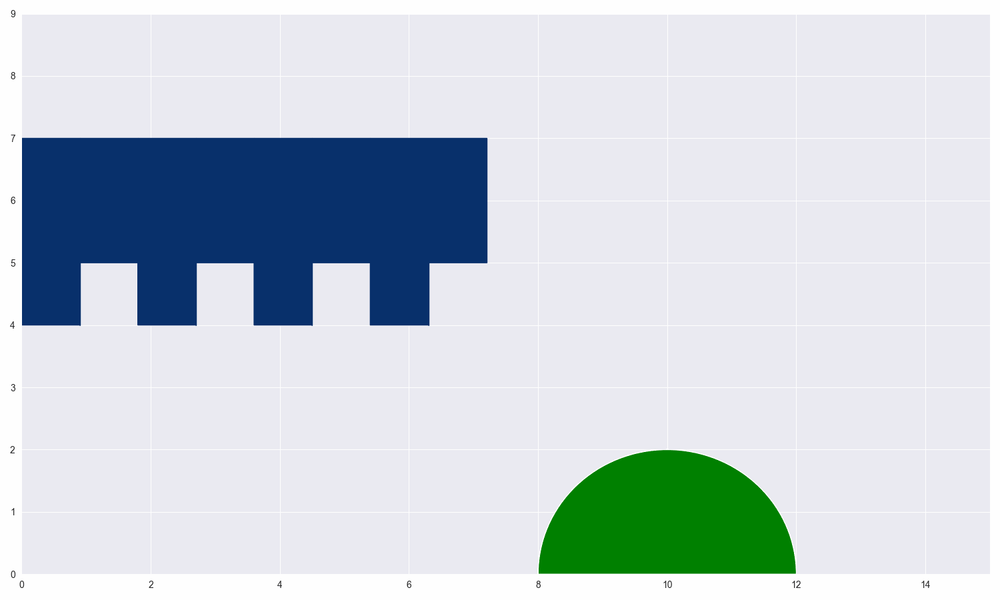
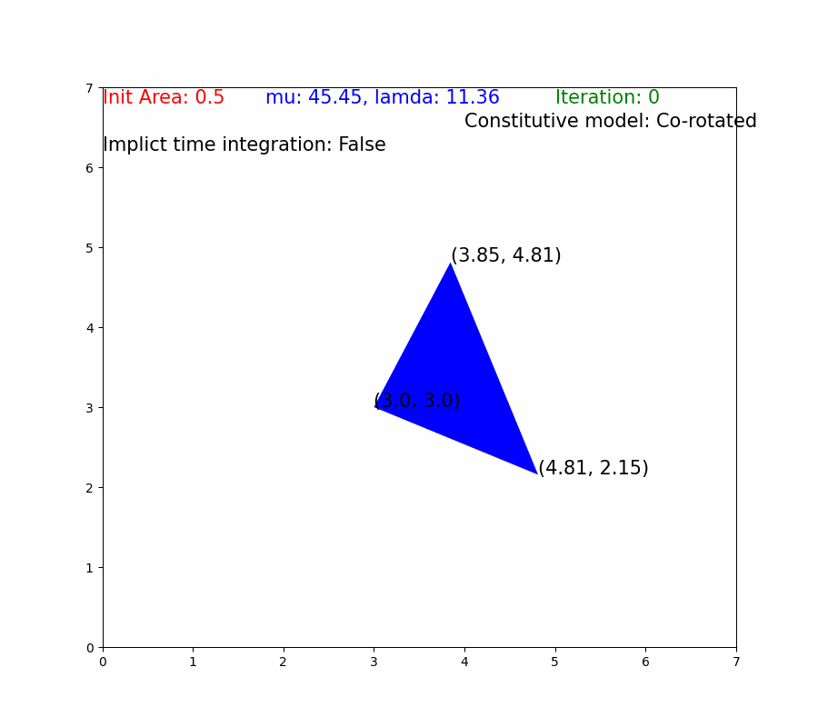

# PythonFem


Linear Finite Element Method (FEM) for simulating hyperelastic cubes, all codes are based on pure Python.

## Overview 

| Constitutive Models |  Time Integration | Multiple cubes  | 
| :------------- | :----------: | :----------: | 
| Linear Elasticity           |    Symplectic Euler   |  Yes  |
| St. Venant-Kirchhoff        |    Symplectic/Implict Euler   | Yes  |
| Corotated linear elasticity |    Symplectic Euler   |  Yes  |
| Neohookean elasticity       |    Symplectic/Implict Euler   |  Yes |

## Requirements  
```python
imageio==2.28.1
matplotlib==3.5.3
numpy==1.21.5
seaborn==0.12.2
```
## Usage 
### Single Terahedron
```shell
python main_single_2d.py
```
Args
```shell
# Parameters of Afine transformation
'--theta', type=float, default=-25.0, help='Counterclockwise rotation angle'
'--tx', type=float, default=3.0, help='Movement along the x-axis'
'--ty', type=float, default=3.0, help='Movement along the y-axis'
'--sx', type=float, default=2, help='Stretching along the x-axis'
'--sy', type=float, default=2, help='Stretching along the y-axis'
    
# Parameters of FEM
'--model', type=int, default=3, help='Constitutive model, 0:Linear, 1:STVK, 2:Co-rotated, 3: Neohookean'
'--Y', type=int, default=100, help='Youngs modulus'
'--V', type=float, default=0.1, help='Poisson ratio, [-1, 0.5]'
'--dt', type=float, default=0.01, help='Time horizon'
'--max_iter', type=int, default=200, help='Iteration'
'--mass', type=float, default=1.0, help='Mass of the point'
'--gravity', type=bool, default=True, help='Add gravity'
'--fix', type=bool, default=True, help='Fix a point on the wall' 
'--implict', action='store_true', help='Implict Euler Method, for STVK and Neohookean'
```
#### Visual Results
**<center>Symplectic Euler Methods</center>**




**<center>Implict Euler Methods</center>**


### Multiple Terahedrons
```shell
python main_multiple_2d.py
```
Args
```shell
'--voxelx', type=int, default=8, help='Number of voxels (x-axis)'
'--voxely', type=int, default=3, help='Number of voxels (y-axis)'
'--em', type=list, default=[2,3,6,7,10,11,14,15], help='Empty voxels:[],[2,3,6,7,10,11,14,15],[2,3,6,7]'
    
# Parameters of FEM
'--mode', type=str, default="bend", help='Mode: bend/fall'
'--model', type=int, default=0, help='Constitutive model, 0:Linear, 1:STVK, 2:Co-rotated, 3: Neohookean'
'--Y', type=int, default=10000, help='Youngs modulus'
'--V', type=float, default=0.1, help='Poisson ratio [-1, 0.5]'
'--dt', type=float, default=0.001, help='Time horizon'
'--max_iter', type=int, default=200, help='Iteration'
'--mass', type=float, default=1.0, help='Mass of the point'
'--implict', action='store_true', help='Implict Euler Method, for STVK and Neohookean'
```
#### Visual Results
<center>Symplectic Euler Methods</center>

**<center>Linear Elasticity</center>**


**<center>St. Venant-Kirchhoff </center>**


**<center>Corotated linear elasticity</center>**


**<center>Neohookean elasticity</center>**


## Reference
[FEM Simulation of 3D Deformable Solids: A practitioner's guide to theory, discretization and model reduction](http://viterbi-web.usc.edu/~jbarbic/femdefo/)

